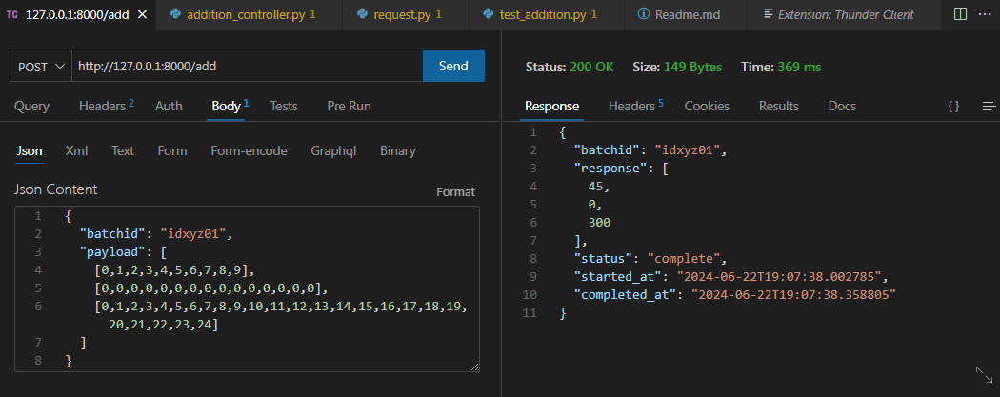

### FastAPI Test Project Guide
This guide will help you set up the project on your local machine. 

### Note: The project is developed using **Python 3.7.5**, so please ensure you have the correct Python version installed.

#### Step 1: Clone the Project
First, clone the project repository using the following command:
```bash
git clone https://github.com/ketan12sharma/fastapi-test.git
```

#### Step 2: Set Up a Virtual Environment
Navigate to the project directory and create a virtual environment to isolate the project's dependencies. Follow these steps:

1. If you don't have the `virtualenv` package installed, run:
   ```bash
   pip install virtualenv
   ```
2. Create a virtual environment named `fastapi-test` (Ensure using **Python 3.7.5** to create virtual environment:
   ```bash
   python -m venv fastapi-test
   ```
3. Activate the virtual environment:
   - On Windows:
     ```bash
     .\fastapi-test\Scripts\activate.bat
     ```
   - On Unix or macOS:
     ```bash
     source fastapi-test/bin/activate
     ```

#### Step 3: Install Dependencies
With the virtual environment activated, install the project's dependencies using the `requirements.txt` file:
```bash
pip install -r requirements.txt
```

#### Step 4: Run the Application
Start the FastAPI application by executing the following command:
```bash
uvicorn main:app --reload
```
This will start the development server with auto-reload enabled.

#### Step 5: Test the Application
You can now test the application using tools like Postman or the [Thunder Client VSCode extension](https://marketplace.visualstudio.com/items?itemName=rangav.vscode-thunder-client).




#### Step 6: Run Tests
To execute the test suite, use the following command:
```bash
pytest tests/
```
### Make sure you're in the project's root directory and the virtual environment is active.